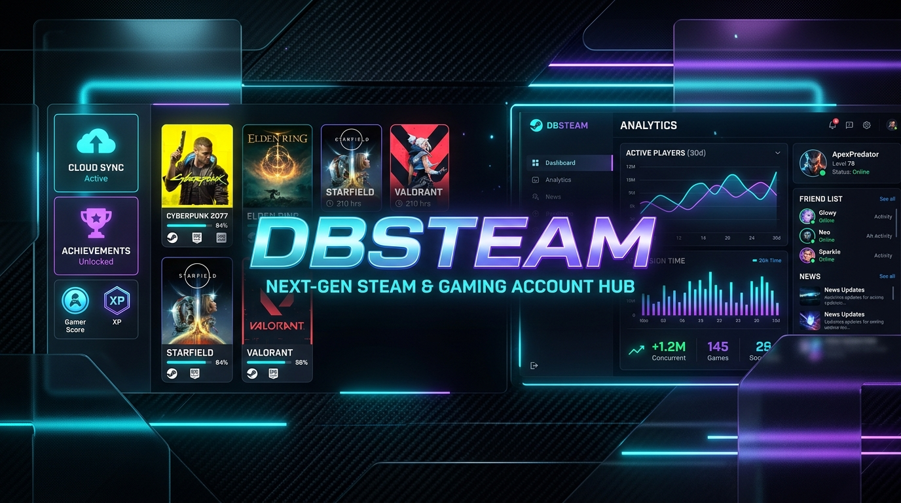
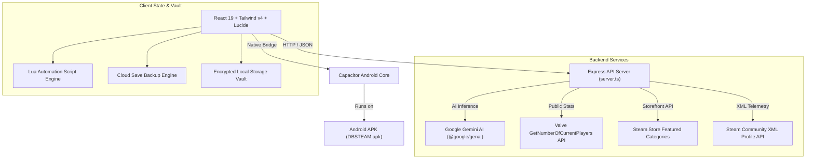

<div align="center">



# DBSTEAM

### Next-Generation Steam & Multi-Platform Gaming Account Hub

[](https://github.com/LIN4CRE/DBSTEAM/actions/workflows/ci.yml)
[](https://github.com/LIN4CRE/DBSTEAM/actions/workflows/build-apk.yml)
[](https://lin4cre.github.io/DBSTEAM/)
[](https://github.com/LIN4CRE/DBSTEAM/releases)
[](LICENSE)
[](https://react.dev/)
[](https://tailwindcss.com/)
[](https://capacitorjs.com/)
[](https://www.typescriptlang.org/)
[](https://deepmind.google/technologies/gemini/)

**[🌐 Live Web Portal](https://lin4cre.github.io/DBSTEAM/)** • **[📦 Download Android APK](https://github.com/LIN4CRE/DBSTEAM/releases/latest)** • **[📖 Documentation](#-table-of-contents)** • **[🚀 Quick Start](#-quick-start)**

---

</div>

## 📖 Overview

**DBSTEAM** is an enterprise-grade gaming operations dashboard designed for gamers, power users, and multi-account managers. It combines real-time Valve public Steam telemetry, SteamDB-powered commercial title intelligence, encrypted cloud save vaults, Lua automation scripting, and Google Gemini AI into one unified, glassmorphic desktop and mobile experience.

Whether managing competitive Steam accounts, auditing ban and trade status, syncing saves across PCs and mobile handhelds, or analyzing player trends across top commercial releases, DBSTEAM provides a unified source of truth.

---

## 🌟 Key Features

### 🛡️ Multi-Account Provisioning & Security Vault
- **Zero-Password Telemetry**: Verify and inspect any Steam profile via public SteamID64 or vanity custom URLs using official Valve XML endpoints.
- **Account Health Diagnostics**: Instant detection of VAC bans, Community bans, Economy/Trade lock states, and limited account statuses.
- **Encrypted Local Vault**: Export account lists and configurations in encrypted, SHA-256 verified JSON structures without exposing plaintext credentials.
- **Provisioning Walkthrough**: Step-by-step guided onboarding for connecting multi-region secondary accounts.

### 📈 SteamDB Top Paid Releases & Real-Time Analytics
- **Curated Commercial Catalog**: Deep catalog of top-selling games with historical pricing, discount percentages, and genres.
- **Live Valve Store Specials**: Direct backend proxy pulling real-time featured sales and discounts straight from Valve servers.
- **Live Concurrent Player Count**: Instant query of real-time active players for any game via official Valve public statistics API.
- **Visual Analytics Dashboard**: Recharts-powered interactive analytics covering price distributions, player concentrations, and platform support.

### ☁️ Cloud Save Backup & Restore Engine
- **Save Integrity Verification**: SHA-256 integrity checksums for game save directories to detect save corruption.
- **Snapshot Rollback**: Revert games to previous snapshot milestones with one click.
- **Multi-Cloud Simulation**: Automated tracking of sync timestamps, sync statuses, and backup payload sizes.

### ⚡ Lua Scripting Automation Hub
- **Automation Runner**: Built-in script execution engine with terminal output emulation for batch game maintenance.
- **Script Repository**: Pre-configured scripts for game installation cleanup, save game compaction, cache pruning, and achievement synchronization.
- **Interactive Configuration**: Real-time parameter tweaking and custom Lua script authoring.

### 🧠 Gemini AI Smart Search
- **Natural Language Discovery**: Ask complex queries like *"Top stealth games with rich story"* or *"Best racing games under $30 with active multiplayer"*.
- **Gemini 3 Flash Integration**: Leverages `@google/genai` to analyze game libraries and produce structured recommendations with verified Steam AppIDs.

### ⌨️ Command Palette & Keyboard Shortcuts
- **Global Command Palette**: Instant navigation and command execution via <kbd>Ctrl</kbd> + <kbd>K</kbd> / <kbd>Cmd</kbd> + <kbd>K</kbd>.
- **Keyboard Shortcuts Modal**: Quick cheat-sheet overlay accessible via <kbd>?</kbd> or <kbd>Shift</kbd> + <kbd>/</kbd>.
- **Toast Notifications**: Non-intrusive action feedback for copy, sync, and export events.

### 📱 Native Android APK (Capacitor)
- **Packaged for Android**: Built with Capacitor 8 with high-performance native WebView, splash screen, and responsive touch layouts.
- **Automated CI/CD**: Every release automatically compiles `DBSTEAM-v1.0.0.apk` via GitHub Actions and attaches it to GitHub Releases.

---

## 🏗️ Architecture



---

## 📁 Repository Structure

```text
DBSTEAM/
├── .github/
│   ├── ISSUE_TEMPLATE/
│   │   ├── bug_report.md
│   │   └── feature_request.md
│   ├── workflows/
│   │   ├── build-apk.yml       # Automated Gradle APK compilation & GitHub Release
│   │   ├── ci.yml              # TypeScript typecheck & Vite build verification
│   │   └── deploy-pages.yml    # GitHub Pages automated deployment
│   └── pull_request_template.md
├── android/                    # Capacitor Native Android Project (Gradle, APK build)
├── assets/
│   └── banner.png              # High-resolution 8K repository banner
├── src/
│   ├── components/
│   │   ├── AccountManager.tsx
│   │   ├── AccountProvisioningWalkthrough.tsx
│   │   ├── AnalyticsDashboard.tsx
│   │   ├── CloudSaveManager.tsx
│   │   ├── CommandPalette.tsx
│   │   ├── GamesDiscovery.tsx
│   │   ├── KeyboardShortcutsModal.tsx
│   │   ├── LuaScriptsManager.tsx
│   │   ├── Navigation.tsx
│   │   ├── PolicyNoticeModal.tsx
│   │   ├── SyncLogsView.tsx
│   │   ├── ToastNotification.tsx
│   │   └── VaultExportModal.tsx
│   ├── data/
│   │   ├── allPaidGames.ts     # Verified SteamDB commercial dataset
│   │   ├── luaScripts.ts       # Automation script definitions
│   │   └── mockData.ts         # Accounts, cloud saves, and activity logs
│   ├── types/
│   │   └── index.ts            # TypeScript domain schemas
│   ├── App.tsx
│   ├── index.css
│   └── main.tsx
├── banner.png                  # Embedded banner for README
├── capacitor.config.json       # Mobile application manifest
├── package.json
├── server.ts                   # Backend proxy & Gemini AI integration
├── tsconfig.json
├── vite.config.ts              # Vite + Tailwind v4 bundler config
├── CONTRIBUTING.md
├── LICENSE                     # MIT License
├── README.md
└── SECURITY.md
```

---

## 🚀 Quick Start

### Prerequisites
- [Node.js](https://nodejs.org/) (v20+ recommended) or [Bun](https://bun.sh/) (v1.1+)
- [Git](https://git-scm.com/)
- *(Optional for Android builds)*: JDK 17+ and Android SDK / Android Studio

### 1. Clone Repository
```bash
git clone https://github.com/LIN4CRE/DBSTEAM.git
cd DBSTEAM
```

### 2. Install Dependencies
```bash
bun install
# or
npm install
```

### 3. Configure Environment Variables
Copy `.env.example` to `.env`:
```bash
cp .env.example .env
```
Fill in your `GEMINI_API_KEY` (optional, for AI smart search features):
```env
GEMINI_API_KEY="your_api_key_here"
PORT=3000
```

### 4. Run Development Server
```bash
bun run dev
# or
npm run dev
```
Open [http://localhost:3000](http://localhost:3000) in your browser.

### 5. Production Web Build
```bash
bun run build
# or
npm run build
```

---

## 📱 Android APK Build & Installation

### Option A: Download Pre-Built APK (Fastest)
1. Navigate to the **[Releases](https://github.com/LIN4CRE/DBSTEAM/releases)** page.
2. Download the latest `DBSTEAM-v1.0.0.apk`.
3. Sideload or install directly on your Android device (Android 8.0+).

### Option B: Build APK with GitHub Actions
Every push to `main` or release tag triggers `.github/workflows/build-apk.yml`, compiling the APK on Ubuntu runners with cached Gradle dependencies.

### Option C: Build APK Locally
```bash
# 1. Build web distribution
npm run build

# 2. Sync web assets into Android project
npm run cap:sync

# 3. Compile APK using Gradle wrapper
cd android
./gradlew assembleDebug

# Output APK is generated at:
# android/app/build/outputs/apk/debug/DBSTEAM-v1.0.0.apk
```

---

## ⌨️ Keyboard Shortcuts Reference

| Shortcut | Description |
| :--- | :--- |
| <kbd>Ctrl</kbd> + <kbd>K</kbd> / <kbd>Cmd</kbd> + <kbd>K</kbd> | Toggle Command Palette |
| <kbd>?</kbd> or <kbd>Shift</kbd> + <kbd>/</kbd> | Open Keyboard Shortcuts Modal |
| <kbd>1</kbd> - <kbd>5</kbd> | Switch between Navigation Views |
| <kbd>Esc</kbd> | Dismiss Active Modal / Command Palette |

---

## 🔒 Security & Privacy

- **No Plaintext Passwords**: DBSTEAM operates strictly on public Steam community identifiers and XML summaries. Credentials are never handled in plaintext.
- **Local-First Architecture**: Account profiles and backup metadata are preserved locally in browser storage.
- **Signed Cloud Exports**: Vault exports can be securely downloaded as JSON with SHA-256 integrity validation.

---

## 📄 License

This project is licensed under the [MIT License](LICENSE) © 2026 **David Linacre**.

---

<div align="center">
<sub>Crafted with precision by <b><a href="https://github.com/LIN4CRE">David Linacre</a></b> • Maintained under the <a href="https://linacre.site">linacre.site</a> ecosystem</sub>
</div>
